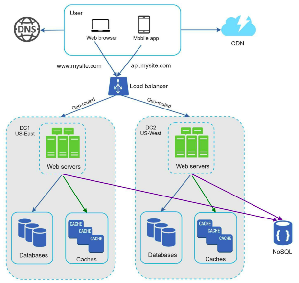
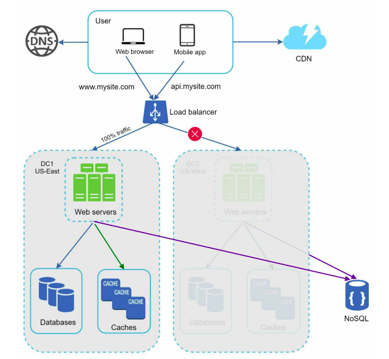

**[Vietnamese Below]**

## Data Centers

As an application grows and attracts more global users, improving **availability** and user experience across different geographical locations becomes essential. The solution is to implement a **multi-data center setup**.

### How Data Centers Work

Figure illustrates a setup with two data centers:

  

- **GeoDNS Routing**: Users are routed based on their geographical location (GeoDNS) to the closest data center. For instance:
  - **x%** of traffic is routed to the US-East data center.
  - **(100 – x)%** of traffic is routed to the US-West data center.
  - **GeoDNS** is a DNS service that resolves domain names to IP addresses based on the user’s location.

- **In case of a failure**:
  - When one data center experiences an outage, all traffic is redirected to a healthy data center.
  - For example, Figure illustrates a scenario where **US-West** is offline, and 100% of traffic is routed to **US-East**.

  

### Technical Challenges in Multi-Data Center Setup

1. **Traffic Redirection**:
   - Redirect traffic to the correct data center.
   - **GeoDNS** is commonly used to ensure traffic is routed to the nearest data center, improving speed and user experience.

2. **Data Synchronization**:
   - Users from different regions may use different **local databases** or **caches**.
   - During failover, traffic routed to another data center may encounter unavailable data.
   - A common solution is to implement **data replication** across multiple data centers. For example, Netflix uses **asynchronous multi-data center replication** to synchronize data. [See more](https://netflixtechblog.com/active-active-for-multi-regional-resiliency-c47719f6685b).

3. **Test and Deployment**:
   - Testing the application across different geographical locations is crucial to ensure performance.
   - Automated deployment tools are vital to maintain service consistency across data centers. [See more](https://netflixtechblog.com/active-active-for-multi-regional-resiliency-c47719f6685b).

### Benefits of Multi-Data Center Setup

1. **Increased Availability**:
   - If one data center fails, traffic can be redirected to another, ensuring uninterrupted service.

2. **Improved User Experience**:
   - GeoDNS ensures users are connected to the nearest data center, reducing latency and improving response times.

3. **International Support**:
   - Supporting multiple data centers globally helps meet the needs of international users more effectively.

### System Design After Adding Multi-Data Centers

To further scale the system, decoupling different components for independent scalability is necessary. A key strategy employed by many real-world distributed systems is using **messaging queues** to address this challenge.

-----------

## Trung tâm dữ liệu

Khi ứng dụng phát triển và thu hút ngày càng nhiều người dùng trên toàn cầu, việc cải thiện tính khả dụng (**availability**) và trải nghiệm người dùng dựa trên vị trí địa lý trở nên cần thiết. Giải pháp chính là triển khai **multi-data center setup**.

### Hoạt Động Của Data Centers

Hình minh họa một thiết lập với hai data center:

  

- **GeoDNS Routing**: Người dùng được định tuyến dựa trên vị trí địa lý (GeoDNS) đến data center gần nhất, ví dụ:
  - **x%** lưu lượng truy cập được gửi đến data center US-East.
  - **(100 – x)%** lưu lượng truy cập được gửi đến data center US-West.
  - **GeoDNS** là dịch vụ DNS cho phép phân giải tên miền thành địa chỉ IP dựa trên vị trí của người dùng.

- **Trong trường hợp sự cố**:
  - Khi một data center bị gián đoạn, toàn bộ lưu lượng truy cập được chuyển đến một data center còn hoạt động. 
  - Ví dụ: Hình minh họa khi **US-West** offline, 100% lưu lượng truy cập sẽ được chuyển đến **US-East**.

  

### Thách Thức Kỹ Thuật Trong Multi-Data Center Setup

1. **Traffic Redirection (Chuyển Hướng Lưu Lượng)**:
   - Chuyển hướng lưu lượng truy cập đến đúng data center mong muốn.
   - **GeoDNS** thường được sử dụng để đảm bảo rằng traffic được chuyển đến data center gần nhất với người dùng, cải thiện tốc độ và trải nghiệm.

2. **Data Synchronization (Đồng Bộ Hóa Dữ Liệu)**:
   - Người dùng từ các khu vực khác nhau có thể sử dụng các **local database** hoặc **cache** khác nhau.
   - Khi một data center gặp sự cố, traffic sẽ được chuyển đến một data center khác. Tuy nhiên, nếu data center này không có dữ liệu người dùng cần, có thể xảy ra lỗi.
   - Giải pháp phổ biến là sử dụng cơ chế **replicate data** giữa các data center. Ví dụ, Netflix sử dụng cơ chế **asynchronous multi-data center replication** để đồng bộ dữ liệu giữa các trung tâm. [Xem thêm](https://netflixtechblog.com/active-active-for-multi-regional-resiliency-c47719f6685b).

3. **Test and Deployment (Kiểm Thử và Triển Khai)**:
   - Với multi-data center setup, việc kiểm thử ứng dụng trên các vị trí địa lý khác nhau là rất quan trọng để đảm bảo hiệu suất.
   - Các công cụ triển khai tự động là cần thiết để giữ cho các dịch vụ nhất quán giữa các data center. [Xem thêm](https://netflixtechblog.com/active-active-for-multi-regional-resiliency-c47719f6685b).

### Lợi Ích Của Multi-Data Center Setup

1. **Tăng Tính Sẵn Sàng (Availability)**:
   - Nếu một data center gặp sự cố, lưu lượng có thể được chuyển hướng đến một data center khác, đảm bảo hệ thống luôn hoạt động.

2. **Cải Thiện Trải Nghiệm Người Dùng (User Experience)**:
   - GeoDNS đảm bảo rằng người dùng được kết nối với data center gần nhất, giảm độ trễ và tăng tốc độ phản hồi.

3. **Hỗ Trợ Quốc Tế (International Support)**:
   - Hỗ trợ nhiều data center trên toàn cầu giúp đáp ứng tốt hơn nhu cầu của người dùng quốc tế.

### Thiết Kế Hệ Thống Sau Khi Thêm Multi-Data Center

Để mở rộng thêm hệ thống, cần tách biệt các thành phần của hệ thống để chúng có thể được mở rộng độc lập. Một chiến lược quan trọng được nhiều hệ thống phân tán thực tế áp dụng là sử dụng **messaging queue** để giải quyết vấn đề này.
