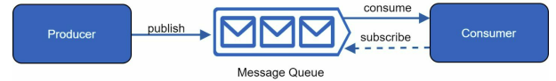
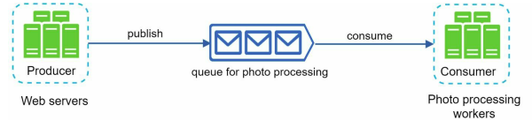

**[Vietnamese Below]**

## Message Queue

When scaling a system, it is crucial to decouple different components so they can operate and scale independently. **Message Queue (MQ)** is a key strategy widely used in large systems to solve this problem.

### What is a Message Queue?

**Message Queue (MQ)** is a mechanism for communication between services or applications. It allows them to send and receive **messages** asynchronously. This means components in the system do not need to wait for immediate responses from each other.

  

- **Producers/Publishers**: Components or applications that send messages to the queue.
- **Consumers/Subscribers**: Components or applications that retrieve messages from the queue and process them.
- **Queue**: Stores messages in order, typically **First In First Out (FIFO)**, but other storage methods can be used depending on system requirements.

### Benefits of Message Queue

**Message Queue** supports **decoupling**, allowing system components to operate independently. For example:

- **Not Real-Time Dependent**:
  - Producers can send messages even if Consumers are unavailable.
  - Consumers can process messages later without needing direct interaction with Producers.

This is similar to SMS communication:
- A sender (Producer) can send a message without the receiver (Consumer) being online.
- The receiver can read and process the message later.

### Real-World Example

A photo processing application with features like **crop**, **sharpening**, and **blurring** can benefit from a message queue. To optimize:

1. **Producers** (web servers) publish photo processing tasks to a queue.
2. **Consumers** (photo processing workers) retrieve tasks from the queue for execution.

Figure illustrates this process:

  

- If the queue size grows, more workers can be added to reduce processing time.
- If the queue is empty most of the time, the number of workers can be reduced to save resources.

This scenario is similar to a store with many orders:
- The store owner (Producer) prepares orders and places them on a table (Queue).
- Shippers (Consumers) pick up orders from the table and deliver them to customers.
- The store owner and shippers do not need direct communication, saving time and improving efficiency.

### Key Benefits

1. **Improved Scalability**:
   - Producers and Consumers can scale independently.
   - Add more Consumers to handle higher workloads or reduce their number when the workload decreases.

2. **High Reliability**:
   - If one component is unavailable, the system continues functioning through the queue.

3. **Simplified Architecture**:
   - Reduces dependency between system components, making it easier to manage and maintain.

------------

## Message Queue

Khi mở rộng hệ thống, việc tách biệt các thành phần khác nhau để chúng có thể hoạt động và mở rộng độc lập là rất quan trọng. **Message Queue (MQ)** là một chiến lược quan trọng, được sử dụng rộng rãi trong nhiều hệ thống lớn để giải quyết vấn đề này.

### Message Queue Là Gì?

**Message Queue (MQ)** là một cơ chế giao tiếp giữa các dịch vụ hoặc ứng dụng, cho phép chúng gửi và nhận thông điệp (**messages**) một cách **không đồng bộ** (**asynchronous**). Điều này có nghĩa là các thành phần của hệ thống không cần chờ phản hồi ngay lập tức từ nhau. 

  

- **Producers/Publishers**: Là thành phần hoặc ứng dụng gửi thông điệp vào hàng đợi (**queue**).
- **Consumers/Subscribers**: Là thành phần hoặc ứng dụng nhận thông điệp từ hàng đợi và xử lý chúng.
- **Queue**: Lưu trữ các thông điệp theo thứ tự, thường là **First In First Out (FIFO)**. Một số hệ thống có thể sử dụng các phương pháp lưu trữ khác dựa trên yêu cầu cụ thể.

### Lợi Ích Của Message Queue

**Message Queue** hỗ trợ **decoupling**, làm cho các thành phần trong hệ thống hoạt động độc lập. Ví dụ:

- **Không phụ thuộc vào thời gian thực**:
  - Producers có thể gửi thông điệp kể cả khi Consumers không hoạt động.
  - Consumers có thể xử lý thông điệp kể cả khi Producers không trực tiếp giao tiếp.

Điều này giống như việc giao tiếp thông qua tin nhắn SMS:
- Người gửi (Producer) có thể gửi tin nhắn mà không cần người nhận (Consumer) phải online ngay lúc đó.
- Người nhận có thể đọc và xử lý tin nhắn sau đó.

### Ví Dụ Thực Tế

Một ví dụ đơn giản là ứng dụng xử lý ảnh với các tính năng như **crop**, **sharpening**, **blurring**, v.v. Những thao tác này mất thời gian để hoàn thành. Để tối ưu hóa:

1. **Producers** (web servers) gửi các yêu cầu xử lý ảnh vào hàng đợi (queue).
2. **Consumers** (photo processing workers) lấy các yêu cầu từ hàng đợi để thực hiện.

Hình minh họa quy trình này:

  

- Nếu số lượng ảnh trong queue tăng lên, chỉ cần tăng số lượng workers để giảm thời gian xử lý.
- Nếu queue thường xuyên trống, giảm số lượng workers để tiết kiệm tài nguyên.

Ví dụ này giống như một cửa hàng với nhiều đơn đặt hàng. 
- Chủ cửa hàng (Producer) làm món ăn xong và đặt trên bàn (Queue).
- Các shipper (Consumers) đến lấy đơn hàng từ bàn và giao đến khách hàng.
- Người bán hàng và shipper không cần giao tiếp trực tiếp, tiết kiệm thời gian và tăng hiệu quả.

### Lợi Ích Cụ Thể

1. **Tăng Tính Khả Mở Rộng (Scalability)**:
   - Producers và Consumers có thể mở rộng độc lập.
   - Thêm nhiều Consumers khi cần xử lý nhanh hơn hoặc giảm số lượng khi ít công việc.

2. **Độ Tin Cậy Cao (Reliability)**:
   - Nếu một thành phần không khả dụng, hệ thống vẫn hoạt động nhờ queue.

3. **Đơn Giản Hóa Kiến Trúc (Simplified Architecture)**:
   - Giảm sự phụ thuộc giữa các thành phần trong hệ thống, giúp quản lý và bảo trì dễ dàng hơn.