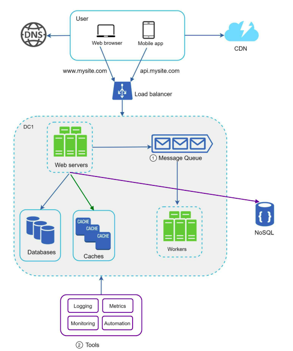

### Logging, Metrics, and Automation

**[English Below]**

Khi làm việc với một trang web nhỏ chạy trên một vài server, **logging**, **metrics**, và **automation** là những thực hành tốt nhưng không thực sự bắt buộc. Tuy nhiên, khi trang web phát triển để phục vụ một doanh nghiệp lớn, việc đầu tư vào các công cụ này trở thành điều **bắt buộc** để đảm bảo hệ thống hoạt động hiệu quả và đáng tin cậy.

#### **Logging**

Việc log lại các lỗi là **cần thiết** để có thể theo dõi (**trace**) lỗi và giải quyết vấn đề một cách nhanh chóng. Có hai cách chính để theo dõi logs:

1. **Theo dõi tại cấp độ server**:
   - Developer có thể trực tiếp kiểm tra log của từng server để tìm và xử lý lỗi.

2. **Tích hợp logs vào dịch vụ tập trung**:
   - Logs từ nhiều server có thể được tập hợp lại tại một **dịch vụ tập trung** để dễ dàng tìm kiếm, theo dõi và giám sát. Điều này đặc biệt hữu ích khi hệ thống có số lượng server lớn.

#### **Metrics**

Việc thu thập các **chỉ số hệ thống** và **chỉ số kinh doanh** giúp:

1. **Hiểu rõ tình trạng của hệ thống**:
   - Các chỉ số về hiệu suất cho biết hệ thống có hoạt động tốt không, có quá tải hay gặp sự cố không.

2. **Hiểu rõ hoạt động kinh doanh**:
   - Các chỉ số kinh doanh giúp đánh giá mức độ thành công và hiệu quả của hệ thống.

Một số loại chỉ số hữu ích:

- **Host-Level Metrics**:
  - CPU, bộ nhớ (Memory), đĩa I/O (Disk I/O), v.v.

- **Aggregated-Level Metrics**:
  - Hiệu suất tổng thể của các tầng như database, cache, v.v.

- **Key Business Metrics**:
  - Số lượng người dùng hoạt động hàng ngày (**daily active users**).
  - Tỷ lệ giữ chân người dùng (**retention**).
  - Doanh thu (**revenue**), v.v.

#### **Automation**

Khi hệ thống trở nên **lớn** và **phức tạp**, cần sử dụng **các công cụ tự động hóa** để cải thiện năng suất và hiệu quả. Một số thực hành tự động hóa phổ biến:

1. **Tích hợp liên tục (Continuous Integration - CI)**:
   - Mỗi lần cập nhật code đều được xác minh thông qua các công cụ tự động hóa, cho phép phát hiện lỗi sớm.

2. **Tự động hóa quy trình**:
   - Tự động hóa các bước **build**, **test**, và **deploy** giúp giảm thiểu sai sót và cải thiện đáng kể năng suất của developer.

#### **Hệ Thống Được Cập Nhật**

Hình minh họa thiết kế cập nhật sau khi thêm các công cụ logging, metrics, và automation.

  

**Các cải tiến chính:**

1. **Message Queue**:
   - Giúp hệ thống giảm sự phụ thuộc giữa các thành phần (**loosely coupled**) và tăng khả năng phục hồi trước lỗi.

2. **Logging, Monitoring, Metrics, and Automation**:
   - Logging và metrics giúp theo dõi và hiểu rõ trạng thái của hệ thống.
   - Automation cải thiện năng suất và đảm bảo tính nhất quán trong các quy trình.

---

When working with a small website running on a few servers, **logging**, **metrics**, and **automation** are good practices but not a necessity. However, as your website grows to support a large business, investing in these tools becomes **essential** to ensure reliability and efficiency.

#### **Logging**

Monitoring error logs is **critical** to identify and resolve system issues quickly. There are two main approaches to logging:

1. **Server-Level Logging**:
   - Developers can directly check logs on individual servers to trace and debug errors.

2. **Centralized Logging**:
   - Logs from multiple servers are aggregated into a **centralized service** for easier searching, monitoring, and tracking. This is particularly helpful for systems with a large number of servers.

#### **Metrics**

Collecting **system** and **business metrics** serves two purposes:

1. **Understand the health of the system**:
   - Performance metrics help detect bottlenecks, overloads, or failures.

2. **Understand business performance**:
   - Business metrics provide insights into system usage and success.

Useful types of metrics:

- **Host-Level Metrics**:
  - CPU, memory usage, disk I/O, etc.

- **Aggregated-Level Metrics**:
  - Overall performance of tiers such as database and cache.

- **Key Business Metrics**:
  - Daily active users, retention rate, revenue, etc.

#### **Automation**

As the system becomes **large** and **complex**, leveraging **automation tools** is essential to improve productivity and reduce errors. Common automation practices include:

1. **Continuous Integration (CI)**:
   - Every code check-in is validated through automation, allowing teams to detect issues early.

2. **Automating Processes**:
   - Automating **build**, **test**, and **deploy** processes minimizes human error and significantly enhances developer productivity.

#### **Updated System Design**

Figure illustrates the updated system design with logging, metrics, and automation tools integrated.

  

**Key Updates:**

1. **Message Queue**:
   - Enables a more loosely coupled system, improving scalability and fault tolerance.

2. **Logging, Monitoring, Metrics, and Automation**:
   - Logging and metrics provide visibility into the system's state.
   - Automation streamlines processes and ensures consistency in workflows.
