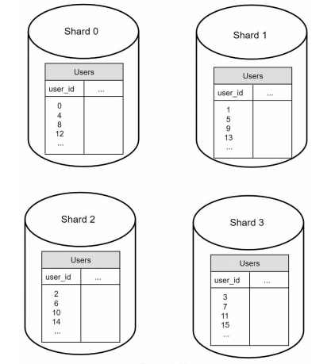

**[Vietnamese Below]**

## Database Scaling

As the system grows, scaling the database becomes essential to handle increasing amounts of data. There are two main approaches: **vertical scaling** and **horizontal scaling**.

### **Vertical Scaling**

**Vertical scaling**, also known as **scaling up**, involves adding more resources (**RAM**, **CPU**, **DISK**, etc.) to the existing database server.

- **Advantages**:
  - Simple and does not require changes to the system architecture.
  - Powerful database servers, such as Amazon RDS, support up to 24TB of RAM.

- **Example**:
  - In 2013, **stackoverflow.com** handled over 10 million monthly users with just **1 master database**.

- **Disadvantages**:
  1. **Hardware Limits**:
     - Hardware has physical limits and cannot scale indefinitely.
  2. **Single Point of Failure (SPOF)**:
     - A single database server is a critical point of failure.
  3. **High Cost**:
     - Powerful database servers are expensive.

### **Horizontal Scaling (Sharding)**

**Horizontal scaling**, or **sharding**, involves adding more database servers to the system.

- **What is Sharding?**:
  - Sharding splits a large database into smaller, more manageable pieces called **shards**.
  - Each **shard** has the same **schema**, but the data is distributed across shards.

  

  

- **Example**:
  - In a user database with primary key **user_id**, data is distributed as follows:
    - **user_id % 4 = 0** → Shard 0.
    - **user_id % 4 = 1** → Shard 1.
    - **user_id % 4 = 2** → Shard 2.
    - **user_id % 4 = 3** → Shard 3.

  

### **Sharding Benefits and Challenges**

**Benefits**:

1. **Scalability**:
   - New shards can be added to handle increased data.
2. **Reduced SPOF**:
   - If one shard fails, others remain operational.

**Challenges**:

1. **Re-sharding**:
   - Required when data grows too quickly or is unevenly distributed across shards.
   - **Consistent hashing** helps mitigate this issue.

2. **Celebrity Problem (Hotspot Key Problem)**:
   - Popular users or entities (e.g., Justin Bieber) can overload a shard.
   - Solutions:
     - Assign a dedicated shard to each celebrity.
     - Further partition that shard if necessary.

3. **Join and De-normalization**:
   - Joining data across shards is complex and inefficient.
   - **De-normalization** helps reduce the need for joins by restructuring data.

### **System Design After Sharding**

Figure illustrates a system design with sharding and NoSQL integration:

  

- **Sharded Database**:
  - Distributes data across multiple shards to balance load and handle large datasets.
- **NoSQL**:
  - Non-relational features are offloaded to NoSQL stores, reducing the database load.

-------------

## Database Scaling

Khi hệ thống phát triển và cần xử lý một lượng dữ liệu lớn hơn, việc **mở rộng database** là điều cần thiết. Có hai cách chính để thực hiện điều này: **vertical scaling** và **horizontal scaling**.

  

### **Vertical Scaling**

**Vertical scaling**, còn được gọi là **scale up**, là việc mở rộng database bằng cách thêm nhiều tài nguyên hơn (**RAM**, **CPU**, **DISK**, v.v.) vào một máy chủ hiện tại.

- **Ưu điểm**:
  - Đơn giản và không yêu cầu thay đổi cấu trúc hệ thống.
  - Một số database server mạnh mẽ có thể hỗ trợ đến 24TB RAM (ví dụ: Amazon RDS).

- **Ví dụ**:
  - **stackoverflow.com** vào năm 2013 có hơn 10 triệu người dùng hàng tháng nhưng chỉ sử dụng **1 master database**.

- **Nhược điểm**:
  1. **Giới hạn phần cứng**:
     - Dù có thể thêm RAM hoặc CPU, phần cứng luôn có giới hạn và không thể mở rộng vô hạn.
  2. **Single Point of Failure (SPOF)**:
     - Chỉ sử dụng một server nghĩa là nếu server đó gặp sự cố, toàn bộ hệ thống sẽ ngừng hoạt động.
  3. **Chi phí cao**:
     - Các server mạnh mẽ có chi phí rất lớn.

### **Horizontal Scaling (Sharding)**

**Horizontal scaling**, hay còn gọi là **sharding**, là việc thêm nhiều máy chủ database vào hệ thống. 

- **Sharding là gì?**:
  - Sharding là chia một database lớn thành nhiều phần nhỏ hơn gọi là **shard**.
  - Các **shard** có **schema giống nhau** (các bảng giống nhau) nhưng dữ liệu bên trong các bảng là khác nhau.

- **Ví dụ về Sharding**:
  - Giả sử có bảng **user** với primary key là **user_id** và 4 shard trong hệ thống.
  - Một cách phân chia dữ liệu:
    - **user_id % 4 = 0** → Shard 0.
    - **user_id % 4 = 1** → Shard 1.
    - **user_id % 4 = 2** → Shard 2.
    - **user_id % 4 = 3** → Shard 3.

  

  

- **Sharding Key**:
  - **Sharding key** (partition key) là một hoặc nhiều cột được sử dụng để xác định cách dữ liệu được phân phối đến các shard.
  - Ví dụ: **user_id** là sharding key trong bảng user.
  - **Lựa chọn sharding key tốt**:
    - Sharding key phải phân phối dữ liệu đồng đều giữa các shard.
    - Tránh tình trạng một số shard bị quá tải (hotspot key problem).

### **Lợi Ích và Hạn Chế Của Sharding**

**Lợi ích**:

1. **Mở rộng dễ dàng**:
   - Có thể thêm nhiều shard vào hệ thống để xử lý lượng dữ liệu tăng lên.
2. **Giảm nguy cơ SPOF**:
   - Nếu một shard gặp sự cố, các shard khác vẫn hoạt động.

**Hạn chế**:

1. **Re-sharding**:
   - Khi một shard không còn đủ khả năng lưu trữ hoặc khi dữ liệu không phân phối đều giữa các shard, cần thực hiện re-sharding.
   - **Consistent hashing** là một kỹ thuật phổ biến để giải quyết vấn đề này.

2. **Celebrity Problem (Hotspot Key Problem)**:
   - Khi một shard chứa dữ liệu của người nổi tiếng (ví dụ: Justin Bieber), lượng truy cập cao có thể gây quá tải shard.
   - Giải pháp:
     - Tạo shard riêng cho từng celebrity.
     - Hoặc chia nhỏ shard đó thành nhiều shard con.

3. **Join và De-normalization**:
   - Join dữ liệu giữa các shard trở nên phức tạp và tốn kém về hiệu suất.
   - Giải pháp: **De-normalization** (phi chuẩn hóa): Tổ chức lại dữ liệu để giảm nhu cầu join giữa các bảng.

### **Thiết Kế Hệ Thống Sau Khi Sharding**

Hình minh họa thiết kế hệ thống với sharding và sử dụng NoSQL để giảm tải cho database:

  

- **Sharded Database**:
  - Hệ thống được chia thành nhiều shard để xử lý lượng dữ liệu lớn và phân phối tải đồng đều.
- **NoSQL**:
  - Một số chức năng không liên quan đến quan hệ được chuyển sang **NoSQL** để giảm tải cho database chính.

---
