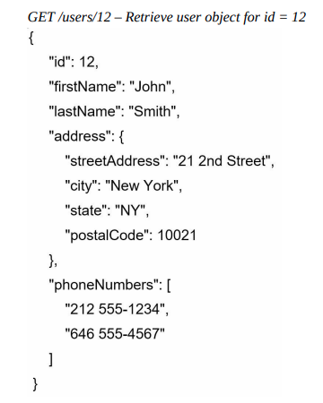

### Single Server Setup

**[English Below]**

Hành trình ngàn dặm bắt đầu từ một bước chân (Lão Tử), và việc xây dựng một hệ thống phức tạp cũng không ngoại lệ. Để bắt đầu một cách đơn giản, mọi thành phần (ứng dụng web, cơ sở dữ liệu, bộ nhớ đệm, v.v) sẽ chạy trên **một máy chủ duy nhất**: 

  

Để hiểu rõ cấu hình này, chúng ta cần tìm hiểu về **request flow** và **traffic source**. Trước tiên, hãy xem xét request flow:

  

1. Người dùng truy cập website thông qua tên miền, chẳng hạn như `api.mysite.com`. Hệ thống quản lý tên miền **(DNS Server)** là một dịch vụ trả phí được cung cấp bởi bên thứ ba và không được lưu trữ trên máy chủ của chúng ta.
2. **Địa chỉ IP** được trả về cho web browser hoặc mobile app. Trong ví dụ này, địa chỉ IP `15.125.23.214` được trả về.
3. Khi đã có địa chỉ IP, **HTTP Request** sẽ được gửi trực tiếp đến web server.
4. **Web server** trả về nội dung các trang HTML hoặc phản hồi JSON để hiển thị.

Tiếp theo, hãy phân tích traffic source. Traffic source đến web server đến từ hai nguồn: Web browser và Mobile app.

- **Web browser**: Sử dụng kết hợp các ngôn ngữ phía máy chủ (Java, Python, v.v.) để xử lý logic nghiệp vụ, lưu trữ, v.v., và các ngôn ngữ máy khách (HTML và JavaScript) để hiển thị giao diện.
- **Mobile app**: Giao thức HTTP là giao thức giao tiếp giữa mobile app và web server. Định dạng phản hồi API thường dùng là JavaScript Object Notation (JSON) vì sự đơn giản của nó. Ví dụ về phản hồi API dưới định dạng JSON như sau: 

  

----------------

A journey of a thousand miles begins with a single step (Lao Tzu), and building a complex system is no different. To start simple, all components (web app, database, cache, etc.) are running on **a single server**:

  

To understand this setup, we need to explore the **request flow** and **traffic source**. First, let’s look at the request flow:

  

1. Users access websites via domain names, such as `api.mysite.com`. The Domain Name System **(DNS Server)** is a paid service provided by third parties and not hosted on our servers.
2. **An IP address** is returned to the web browser or mobile app. In this example, the IP address `15.125.23.214` is returned.
3. Once the IP address is obtained, **HTTP Requests** are sent directly to the web server.
4. The **web server** returns HTML content or JSON responses for rendering.

Next, let’s examine the traffic source. Traffic to the web server comes from two sources: web browsers and mobile apps.

- **Web browsers**: They use a combination of server-side languages (Java, Python, etc.) to handle business logic, storage, etc., and client-side languages (HTML and JavaScript) for rendering the user interface.
- **Mobile apps**: HTTP is the communication protocol between the mobile app and the web server. The commonly used API response format is JavaScript Object Notation (JSON) due to its simplicity. An example of an API response in JSON format is as follows:

  

