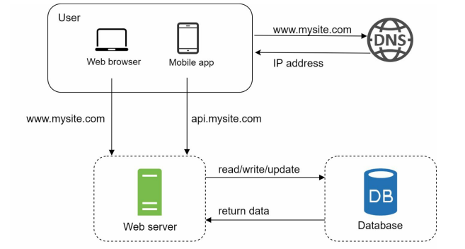

### Database

**[English Below]**

Với sự tăng lên của user đối với application lớn hơn thì một server là không đủ, khi đó cần sử dụng multiple-server: một server để xử lý web/mobile traffic, một server để lưu trữ database. Việc tách biệt web/mobile traffic server (tầng web) và database server (tầng dữ liệu) cho phép chúng được mở rộng quy mô một cách độc lập.

  

#### Sử dụng cơ sở dữ liệu nào?

Bạn có thể lựa chọn giữa **cơ sở dữ liệu quan hệ** (Relational Database) và **cơ sở dữ liệu phi quan hệ** (Non-Relational Database). Hãy cùng tìm hiểu kỹ hơn:

- **Cơ sở dữ liệu quan hệ**: 
  - Còn được gọi là hệ thống quản lý cơ sở dữ liệu quan hệ (RDBMS) hoặc cơ sở dữ liệu SQL.
  - Các loại phổ biến: MySQL, Oracle Database, PostgreSQL, v.v.
  - Biểu diễn và lưu trữ dữ liệu dưới dạng **bảng** và **hàng**, cho phép thực hiện các thao tác **join** giữa các bảng bằng SQL.
  - Đây là lựa chọn phổ biến và được sử dụng rộng rãi vì đã tồn tại hơn 40 năm, đồng thời hoạt động ổn định trong hầu hết các trường hợp.

- **Cơ sở dữ liệu phi quan hệ**:
  - Còn được gọi là cơ sở dữ liệu NoSQL.
  - Các loại phổ biến: CouchDB, Neo4j, Cassandra, HBase, Amazon DynamoDB, v.v. [2].
  - Dữ liệu được nhóm thành bốn loại: 
    - **Key-Value Stores**: Lưu trữ cặp khóa-giá trị.
    - **Graph Stores**: Lưu trữ dữ liệu dưới dạng đồ thị.
    - **Column Stores**: Lưu trữ dữ liệu theo cột.
    - **Document Stores**: Lưu trữ dữ liệu dưới dạng tài liệu.
  - Các phép **join** thường không được hỗ trợ.

#### Khi nào nên chọn Non-Relational Database?

Trong một số trường hợp, cơ sở dữ liệu phi quan hệ có thể phù hợp hơn cơ sở dữ liệu quan hệ, đặc biệt khi:

1. Ứng dụng yêu cầu **độ trễ cực thấp**.
2. Dữ liệu không có cấu trúc hoặc không có mối quan hệ.
3. Chỉ cần **tuần tự hóa** (serialize) và **giải tuần tự hóa** (deserialize) dữ liệu (ví dụ: JSON, XML, YAML, v.v.).
4. Cần lưu trữ một **lượng dữ liệu khổng lồ**.

Ví dụ: Với một hệ thống lớn cần hiệu năng cao và dữ liệu phức tạp, việc kết hợp cả hai loại cơ sở dữ liệu (quan hệ và phi quan hệ) có thể là giải pháp tối ưu. Một cơ sở dữ liệu quan hệ có thể được sử dụng cho dữ liệu giao dịch, trong khi cơ sở dữ liệu phi quan hệ có thể được sử dụng cho dữ liệu không có cấu trúc.

#### Kết Luận

Lựa chọn cơ sở dữ liệu phù hợp phụ thuộc vào nhu cầu cụ thể của hệ thống. Với hầu hết các ứng dụng truyền thống, cơ sở dữ liệu quan hệ là lựa chọn tốt. Tuy nhiên, với các ứng dụng hiện đại yêu cầu hiệu năng cao hoặc xử lý dữ liệu phi cấu trúc, việc sử dụng cơ sở dữ liệu phi quan hệ là một hướng đi cần cân nhắc.

---

With the growth of the user base for larger applications, a single server is no longer sufficient. In this case, multiple servers are needed: one server to handle web/mobile traffic and another to store the database. Separating web/mobile traffic servers (web tier) and database servers (data tier) allows for independent scalability.

  

#### Which Database to Use?

You can choose between **Relational Databases** and **Non-Relational Databases**. Let’s take a closer look:

- **Relational Databases**:
  - Also known as Relational Database Management Systems (RDBMS) or SQL databases.
  - Common types: MySQL, Oracle Database, PostgreSQL, etc.
  - Represent and store data in **tables** and **rows**, allowing for **join** operations across tables using SQL.
  - A popular choice because they have existed for over 40 years and work well in most cases.

- **Non-Relational Databases**:
  - Also known as NoSQL databases.
  - Common types: CouchDB, Neo4j, Cassandra, HBase, Amazon DynamoDB, etc. [2].
  - Data is grouped into four categories:
    - **Key-Value Stores**: Store data as key-value pairs.
    - **Graph Stores**: Store data as graphs.
    - **Column Stores**: Store data in columns.
    - **Document Stores**: Store data as documents.
  - **Join** operations are generally not supported.

#### When to Choose Non-Relational Databases?

In some cases, non-relational databases may be a better fit than relational databases, especially when:

1. The application requires **ultra-low latency**.
2. The data is unstructured or lacks relationships.
3. You only need to **serialize** and **deserialize** data (e.g., JSON, XML, YAML, etc.).
4. You need to store **massive amounts of data**.

For example, in a large system requiring high performance and handling complex data, a combination of both relational and non-relational databases might be optimal. A relational database can be used for transactional data, while a non-relational database can be used for unstructured data.

#### Conclusion

Choosing the right database depends on the specific needs of your system. For most traditional applications, relational databases are a solid choice. However, for modern applications requiring high performance or handling unstructured data, non-relational databases are worth considering.
