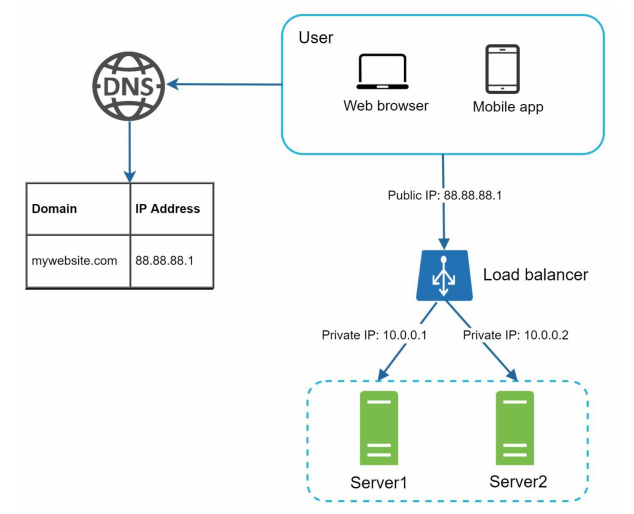

### Load Balancer

**[English Below]**

Load balancer là một thiết bị hoặc phần mềm được sử dụng để phân phối đồng đều các **incoming traffic** đến các server trong hệ thống. Mục tiêu chính là đảm bảo rằng không có server nào bị quá tải, đồng thời tăng tính sẵn sàng và độ tin cậy của hệ thống.

  

#### Cách hoạt động của Load Balancer

- **Kết nối qua Public IP**: Người dùng truy cập domain và gửi request đến DNS. DNS trả về public IP của load balancer. Với cách thiết kế này, client không thể trực tiếp gửi request đến IP của server.
- **Giao tiếp qua Private IP**: Để đảm bảo tính bảo mật, load balancer và các server giao tiếp với nhau qua private IP. Private IP là địa chỉ IP chỉ kết nối được giữa các server trong cùng một mạng và không thể truy cập qua internet.

#### Lợi ích của Load Balancer

Với thiết kế này, chúng ta đã giải quyết được các vấn đề liên quan đến **failover** và cải thiện tính khả dụng (availability) của hệ thống:

1. **Giải quyết Failover**:
   - Nếu một server bị down (ví dụ: Server 1), traffic sẽ được tự động chuyển hướng sang server khác (ví dụ: Server 2). 
   - Khi server mới được thêm vào, hệ thống sẽ tự động cân bằng tải bằng cách phân phối traffic đến tất cả các server.

2. **Khả năng mở rộng linh hoạt**:
   - Nếu traffic tăng đột biến và hai server không thể xử lý hết, chỉ cần thêm server mới vào hệ thống. Load balancer sẽ tự động phân phối request đến server mới mà không cần thay đổi cấu trúc hệ thống.

3. **Tăng tính bảo mật**:
   - Vì các server không thể truy cập trực tiếp từ client, rủi ro bảo mật được giảm thiểu.

#### Tiếp Theo: Data Tier

Ở cấp độ này, web tier đã được thiết kế khá ổn định. Tuy nhiên, data tier vẫn có một số hạn chế. Hiện tại, thiết kế chỉ có một cơ sở dữ liệu, do đó không hỗ trợ **failover** và **redundancy**. Để giải quyết vấn đề này, chúng ta có thể sử dụng kỹ thuật **database replication**.

---

### Load Balancer

A load balancer is a device or software used to evenly distribute **incoming traffic** among servers in a system. The primary goal is to ensure no single server becomes overloaded while increasing the availability and reliability of the system.

  

#### How a Load Balancer Works

- **Connecting via Public IP**: Users access the domain and send requests to DNS. DNS returns the public IP of the load balancer. With this setup, clients cannot directly send requests to server IPs.
- **Communication via Private IP**: To ensure security, the load balancer and servers communicate via private IPs. Private IPs are only accessible between servers within the same network and are not reachable from the internet.

#### Benefits of a Load Balancer

This design resolves **failover issues** and improves the system's **availability**:

1. **Failover Handling**:
   - If one server (e.g., Server 1) goes down, the traffic is automatically rerouted to other servers (e.g., Server 2).
   - When a new server is added to the system, the load balancer automatically distributes traffic across all available servers.

2. **Scalability**:
   - If traffic grows rapidly and two servers are insufficient, new servers can be added to the system. The load balancer seamlessly integrates the new servers and distributes requests without requiring architectural changes.

3. **Enhanced Security**:
   - Since servers are not directly accessible by clients, security risks are minimized.

#### Next: Data Tier

At this level, the web tier is well-designed. However, the data tier still has some limitations. The current design uses a single database, which does not support **failover** or **redundancy**. To address this, **database replication** is a common solution.
