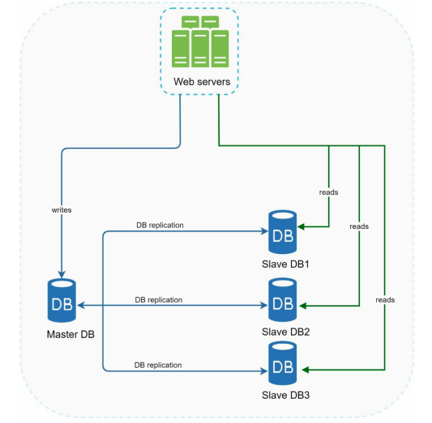
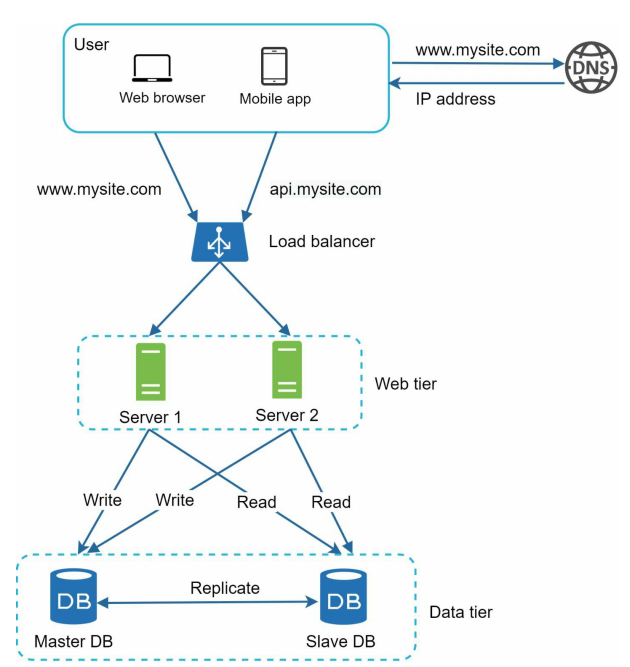

### Database Replication

**[English Below]**

Trong thiết kế trước đây với server riêng cho database, một vấn đề lớn có thể xảy ra là: **nếu server chứa database bị down thì sao?** Để giải quyết vấn đề này, **Database Replication** được ra đời.

#### Database Replication là gì?

Database replication là kỹ thuật tạo ra mối quan hệ **master/slave** giữa cơ sở dữ liệu chính (**master**) và các bản sao (**slave**). Nói một cách đơn giản, đây là việc sao chép cơ sở dữ liệu chính thành nhiều bản sao trên các server khác. 

- **Master Database**: Chỉ cho phép các quyền **write** (ghi), bao gồm các thao tác như `insert`, `delete`, `modify`.
- **Slave Database**: Chỉ cho phép các quyền **read** (đọc), phục vụ cho các yêu cầu truy xuất dữ liệu.

Vì hầu hết các hệ thống có số lượng thao tác **đọc** nhiều hơn so với **ghi**, số lượng slave database thường lớn hơn master database. Minh họa một master database với nhiều slave database.

  

#### Lợi ích của Database Replication

Tương tự như **horizontal scaling**, database replication mang lại những lợi ích quan trọng sau:

1. **Hiệu năng tốt hơn (Performance)**:
   - Các thao tác ghi/ghi đè được xử lý ở master.
   - Các thao tác đọc được phân phối đều giữa các slave. Điều này giúp hệ thống xử lý nhiều yêu cầu đồng thời hơn.

2. **Độ tin cậy cao (Reliability)**:
   - Dữ liệu được sao chép trên nhiều server. Nếu một server gặp sự cố (do thiên tai, lỗi phần cứng, v.v.), dữ liệu vẫn được bảo toàn.

3. **Tính khả dụng cao (High Availability)**:
   - Nếu một database server bị offline, các server khác vẫn tiếp tục hoạt động. Điều này đảm bảo hệ thống không bị gián đoạn.

#### Cách Database Replication Hoạt Động Khi Có Sự Cố

1. **Khi Slave Database bị Down**:
   - Nếu chỉ có một slave, các quyền đọc sẽ tạm thời chuyển sang master database.
   - Khi slave gặp sự cố được khắc phục, một slave mới sẽ được tạo để thay thế.
   - Nếu có nhiều slave, quyền đọc sẽ tự động được chuyển sang các slave khác còn hoạt động.

2. **Khi Master Database bị Down**:
   - Một slave sẽ được **chuyển đổi thành master** để tiếp tục xử lý các quyền write.
   - Một slave mới sẽ được thêm vào để đảm bảo quá trình sao chép dữ liệu.
   - Trong thực tế, việc chuyển đổi này phức tạp hơn do dữ liệu của slave có thể chưa được cập nhật đầy đủ. Một số phương pháp như **multi-master replication** hoặc **circular replication** có thể được áp dụng nhưng yêu cầu cấu hình phức tạp.

#### Tổng Quan Hoạt Động

Minh họa thiết kế hệ thống sau khi thêm load balancer và database replication:

  

1. Người dùng lấy IP của load balancer thông qua DNS.
2. Request được gửi đến load balancer.
3. Load balancer phân phối request đến các server web.
4. Các request đọc dữ liệu được gửi đến slave database.
5. Các request ghi dữ liệu (insert, update, delete) được gửi đến master database.

Với thiết kế này, **data tier** đã đạt mức ổn định cao. Tiếp theo, chúng ta sẽ tìm hiểu cách cải thiện thời gian phản hồi thông qua **cache layer** và **Content Delivery Network (CDN)**.

---

### Database Replication

Quoted from Wikipedia: *“Database replication can be used in many database management systems, usually with a master/slave relationship between the original (master) and the copies (slaves)”* [3].

#### What is Database Replication?

Database replication is a technique that creates a **master/slave** relationship between the original database (**master**) and its replicas (**slaves**). Simply put, it copies the master database into multiple replicas stored on other servers.

- **Master Database**: Supports only **write** operations like `insert`, `delete`, and `modify`.
- **Slave Database**: Supports only **read** operations for retrieving data.

Most systems have a higher ratio of read operations compared to write operations. Therefore, the number of slave databases is usually larger than the number of master databases. The below figure illustrates a master database with multiple slave databases.

  

#### Benefits of Database Replication

Like **horizontal scaling**, database replication provides the following benefits:

1. **Better Performance**:
   - Write operations are handled by the master.
   - Read operations are distributed across slaves, enabling the system to handle more queries in parallel.

2. **Improved Reliability**:
   - Data is replicated across multiple servers. If one server fails (due to hardware failure or disasters), data remains intact.

3. **High Availability**:
   - If one database server goes offline, other servers can continue operating, ensuring system uptime.

#### Handling Failures in Database Replication

1. **When a Slave Database Fails**:
   - If there is only one slave, read operations temporarily fall back to the master.
   - Once the issue is resolved, a new slave replaces the failed one.
   - If multiple slaves are available, read operations are redirected to healthy slaves.

2. **When the Master Database Fails**:
   - A slave is **promoted to master** to continue handling write operations.
   - A new slave is added to replace the failed one.
   - In production systems, promoting a new master is complex due to potential data inconsistencies. Methods like **multi-master replication** or **circular replication** can help but require more complex setups.

#### Overview of System Design

The below figure shows the system design after adding load balancer and database replication:

  

1. A user retrieves the load balancer's IP via DNS.
2. Requests are sent to the load balancer.
3. The load balancer distributes requests to web servers.
4. Read requests are sent to slave databases.
5. Write requests (insert, update, delete) are sent to the master database.

With this design, the **data tier** achieves high stability. Next, we will explore improving response times with a **cache layer** and **Content Delivery Network (CDN)**.
