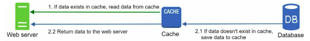
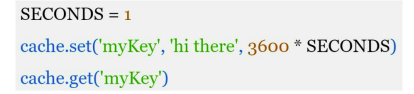
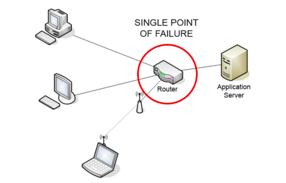

**[Vietnamese Below]**

## Cache

A **cache** is a temporary storage area that stores frequently accessed data or expensive responses in memory, allowing subsequent requests to be processed faster. As illustrated in the previous design, each time a new web page loads, one or more database queries may be required to fetch data. Repeatedly querying the database greatly affects application performance. A cache can mitigate this issue.

### Cache Tier

The **cache tier** is a temporary data store layer that is significantly faster than a database. Using a cache tier offers several key benefits:

- **Improved System Performance**: Cache reduces response time by temporarily storing queried data.
- **Reduced Database Workload**: It decreases the number of direct queries to the database.
- **Independent Scalability**: The cache tier can be scaled independently of other layers.

The following diagram illustrates a possible cache server setup:

  

### How Cache Works

When a web server receives a request:

1. **Check Cache**: The web server checks if the cache contains the response.
   - **If yes**: The response is immediately sent to the client.
   - **If no**: The web server queries the database, stores the response in the cache, and then sends it to the client.

This approach is called **read-through cache**. Other caching strategies can be applied depending on the data type, size, and access patterns.

Interacting with cache servers is straightforward because most cache servers provide APIs for popular programming languages. Below is an example of Memcached APIs:

  

### Considerations for Using Cache

1. **When to Use Cache**:
   - Cache is suitable for data that is read frequently but modified infrequently.
   - Cache is not ideal for **persistent data** because cached data is stored in volatile memory. 
   - If the cache server restarts, **all cached data will be lost**. Therefore, important data should be stored in **persistent data stores**.

2. **Expiration Policy**:
   - Cached data should have an expiration time to avoid being stored indefinitely.
   - Avoid setting the **time to expire** too short (increases database queries) or too long (data might become stale).

3. **Consistency**:
   - Ensure that the cache data is consistent with the source data in the database.
   - This is particularly important in distributed systems or when data changes frequently.

4. **Mitigating Failures**:
   - Avoid **Single Point of Failure (SPOF)** by using multiple cache servers to distribute risks and improve reliability.
   - **Overprovisioning Memory**: Allocating extra memory ensures the system doesn’t overload during traffic spikes.

  

5. **Eviction Policy**:
   - When the cache is full, older items must be removed to make space for new ones.
   - Common policies include:
     - **Least Recently Used (LRU)**: Evicts the least recently accessed items.
     - **Least Frequently Used (LFU)**: Evicts the least accessed items.
     - **First In First Out (FIFO)**: Evicts the oldest items first.

---------------------

## Cache

**Bộ nhớ đệm (Cache)** là một vùng lưu trữ tạm thời, lưu trữ kết quả của các phản hồi tốn kém hoặc dữ liệu được truy cập thường xuyên trong bộ nhớ, giúp các yêu cầu sau đó được xử lý nhanh hơn. Như trong thiết kế đã chỉ ra ở phần trước, mỗi khi tải một trang web mới, có thể phải thực hiện một hoặc nhiều truy vấn đến database để lấy dữ liệu. Hiệu suất ứng dụng bị ảnh hưởng rất nhiều khi gọi database liên tục. Bộ nhớ đệm có thể giảm thiểu vấn đề này.

### Cache Tier

**Cache tier** là tầng lưu trữ dữ liệu tạm thời, có tốc độ truy xuất nhanh hơn database rất nhiều. Việc sử dụng cache tier mang lại những lợi ích quan trọng sau:

- **Tăng hiệu năng hệ thống**: Cache giúp giảm thời gian phản hồi của hệ thống bằng cách lưu trữ tạm thời các dữ liệu đã truy vấn.
- **Giảm tải cho database**: Giảm số lượng request trực tiếp đến database.
- **Khả năng mở rộng**: Cache tier có thể được mở rộng độc lập mà không ảnh hưởng đến các tầng khác.

Hình minh họa cách thiết lập một cache server:

  

### Cách Hoạt Động của Cache

Khi web server nhận được một request:

1. **Kiểm tra cache**: Web server kiểm tra xem cache có chứa dữ liệu phản hồi không.
   - **Nếu có**: Dữ liệu được gửi ngay lập tức đến client.
   - **Nếu không**: Web server gửi query đến database để lấy dữ liệu, lưu lại vào cache, sau đó gửi phản hồi cho client.

Cách tiếp cận này được gọi là **read-through cache**. Ngoài ra, có nhiều chiến lược cache khác có thể áp dụng tùy thuộc vào kiểu dữ liệu, kích thước và cách truy cập.

Tương tác với máy chủ bộ nhớ đệm rất đơn giản vì hầu hết các máy chủ bộ nhớ đệm cung cấp API cho các ngôn ngữ lập trình phổ biến. Dưới đây là một ví dụ về API Memcached.

  

### Các Lưu Ý Khi Sử Dụng Cache

1. **Khi nào sử dụng cache**:
   - Cache phù hợp cho các dữ liệu ít thay đổi nhưng được đọc thường xuyên.
   - Cache không phù hợp cho **persistent data** (dữ liệu lưu trữ lâu dài), vì dữ liệu trong cache sẽ bị mất khi hệ thống khởi động lại.
   - Nếu máy chủ bộ nhớ đệm khởi động lại, **toàn bộ dữ liệu** trong bộ nhớ **sẽ bị mất**. Vì vậy, dữ liệu quan trọng nên được lưu trong các **kho dữ liệu bền vững (persistent data stores)**.

2. **Cơ chế expire**:
   - Dữ liệu trong cache cần có thời gian hết hạn để tránh việc lưu trữ mãi mãi.
   - Không nên để **time expire** quá ngắn (tăng số lượng query đến database) hoặc quá dài (dữ liệu dễ bị lỗi thời).

3. **Tính nhất quán (Consistency)**:
   - Dữ liệu trong cache cần đồng bộ với dữ liệu gốc trong database.
   - Điều này đặc biệt quan trọng trong các hệ thống phân tán hoặc khi dữ liệu thường xuyên thay đổi.

4. **Giảm thiểu lỗi (Mitigating Failures)**:
   - Tránh **Single Point of Failure (SPOF)**(Xem thêm [tại đây](https://en.wikipedia.org/wiki/Single_point_of_failure)) bằng cách sử dụng nhiều cache server để giảm rủi ro và cải thiện hiệu suất.
   - **Overprovisioning Memory**: Cung cấp bộ nhớ dự phòng để đảm bảo hệ thống không bị quá tải khi traffic tăng.

  

5. **Eviction Policy**:
   - Khi bộ nhớ cache đầy, các item cũ cần bị xóa để nhường chỗ cho item mới.
   - Các chính sách phổ biến:
     - **Least Recently Used (LRU)**: Loại bỏ item ít được truy cập gần đây nhất.
     - **Least Frequently Used (LFU)**: Loại bỏ item ít được truy cập nhất.
     - **First In First Out (FIFO)**: Loại bỏ item được thêm vào đầu tiên.