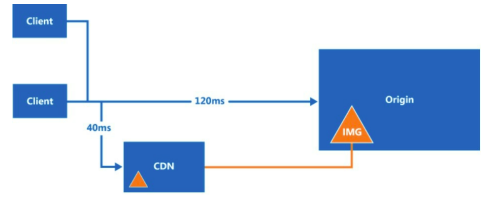
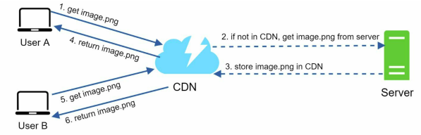
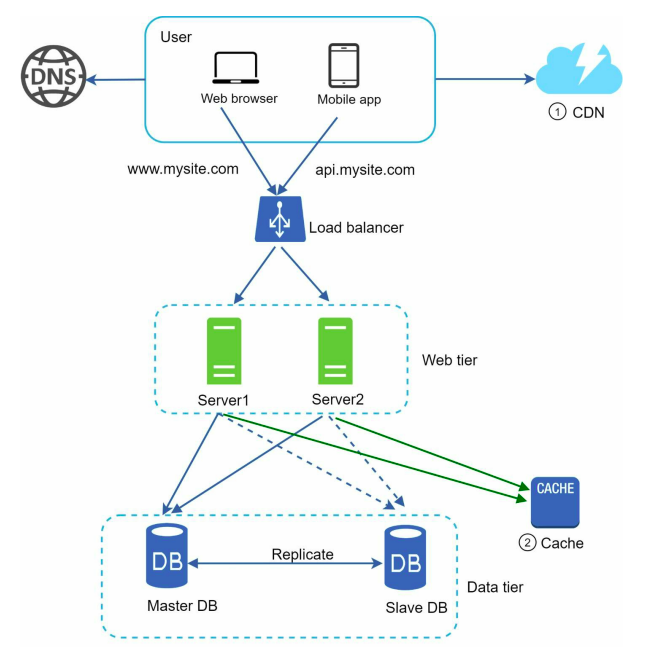

### Content Delivery Network (CDN)

**[English Below]**

**Content Delivery Network (CDN)** là một mạng lưới các server được phân bổ tại nhiều địa điểm khác nhau, được sử dụng để phục vụ nội dung tĩnh (static content). Các server CDN lưu trữ (cache) nội dung tĩnh như hình ảnh, video, CSS, file JavaScript, v.v.

#### Nội Dung Tĩnh vs Nội Dung Động

Việc caching nội dung động (dynamic content caching) là một khái niệm mới hơn và không nằm trong phạm vi của tài liệu này. Caching nội dung động cho phép lưu trữ các trang HTML dựa trên đường dẫn yêu cầu, chuỗi truy vấn, cookie và các header yêu cầu. Có thể tham khảo thêm [tại đây](https://www.cloudflare.com/learning/cdn/caching-static-and-dynamic-content/) để tìm hiểu thêm về chủ đề này. 

Trong tài liệu này, chúng ta tập trung vào cách sử dụng CDN để lưu trữ nội dung tĩnh.

#### Cách Hoạt Động Của CDN

Cơ chế hoạt động của CDN:

1. Khi người dùng truy cập vào một website, server CDN gần nhất với người dùng sẽ cung cấp nội dung tĩnh. 
   - Người dùng càng ở xa server CDN, tốc độ tải trang càng chậm. 
   - Ví dụ: Nếu server CDN đặt tại San Francisco, người dùng ở Los Angeles sẽ tải nội dung nhanh hơn người dùng ở Châu Âu.

  

Quy trình hoạt động của CDN:

1. **User A** gửi yêu cầu lấy `image.png` thông qua URL hình ảnh. Domain trong URL được cung cấp bởi nhà cung cấp CDN. Ví dụ:
   - `https://mysite.cloudfront.net/logo.jpg`
   - `https://mysite.akamai.com/image-manager/img/logo.jpg`
   
2. Nếu server CDN không có file `image.png` trong cache, nó sẽ yêu cầu file từ server gốc (origin), chẳng hạn như web server hoặc lưu trữ trực tuyến như Amazon S3.

3. Server gốc trả về file `image.png` cho server CDN, kèm theo **HTTP header TTL (Time-to-Live)**, chỉ định thời gian file sẽ được lưu trong cache.

4. Server CDN lưu file vào cache và trả về nội dung cho **User A**.

5. Khi **User B** yêu cầu cùng file `image.png`, server CDN sẽ trả về file từ cache, miễn là TTL chưa hết hạn.

  

#### Những Lưu Ý Khi Sử Dụng CDN

1. **Chi phí**:
   - CDN được vận hành bởi các nhà cung cấp bên thứ ba và tính phí dựa trên lưu lượng truyền dữ liệu vào và ra khỏi CDN.
   - Việc cache những tài nguyên ít được sử dụng không mang lại nhiều lợi ích, do đó bạn nên cân nhắc loại bỏ chúng khỏi CDN để tối ưu chi phí.

2. **Thời gian hết hạn cache (Cache Expiry)**:
   - Đối với nội dung nhạy cảm về thời gian, việc đặt thời gian hết hạn cache là rất quan trọng.
   - Thời gian hết hạn không nên quá dài (nội dung có thể không còn mới) hoặc quá ngắn (gây tải lại nội dung thường xuyên từ server gốc đến CDN).

3. **CDN Fallback**:
   - Bạn cần xem xét cách ứng dụng/website của mình đối phó khi CDN gặp sự cố.
   - Trong trường hợp CDN tạm thời ngừng hoạt động, client nên có khả năng phát hiện sự cố và gửi yêu cầu trực tiếp đến server gốc.

4. **Xóa nội dung trước khi hết hạn (Invalidating files)**:
   - Bạn có thể xóa file khỏi CDN trước khi hết hạn thông qua các cách sau:
     - Sử dụng API do nhà cung cấp CDN cung cấp để **invalidate** đối tượng trong CDN.
     - Sử dụng **Object Versioning**: Thêm một tham số vào URL để yêu cầu phiên bản mới của file. Ví dụ:
       - `image.png?v=2` (phiên bản 2 của file).

#### Thiết Kế Hệ Thống Sau Khi Thêm CDN

  

1. Nội dung tĩnh (JS, CSS, hình ảnh, v.v.) không còn được phục vụ bởi web server. Chúng được lấy từ CDN để cải thiện hiệu năng.
2. Tải lên database được giảm đáng kể nhờ caching dữ liệu.

---

**Content Delivery Network (CDN)** is a network of geographically distributed servers used to deliver static content. CDN servers cache static content such as images, videos, CSS, and JavaScript files to improve website performance and reduce latency.

#### Static vs Dynamic Content

Dynamic content caching is a relatively new concept and not within the scope of this document. Dynamic content caching allows HTML pages to be cached based on request paths, query strings, cookies, and request headers. To learn more, refer to this [article on caching static and dynamic content](https://www.cloudflare.com/learning/cdn/caching-static-and-dynamic-content/).

This document focuses on using CDN to cache static content.

#### How CDN Works

The working mechanism of a CDN is as follows:

1. When a user visits a website, the nearest CDN server delivers the static content to the user.
   - The further a user is from the CDN server, the slower the website loads.
   - For instance, if the CDN server is located in San Francisco, users in Los Angeles will load content faster than users in Europe.

  

The CDN workflow includes the following steps:

1. **User A** sends a request to fetch `image.png` via a CDN-provided URL. Example URLs include:
   - `https://mysite.cloudfront.net/logo.jpg`
   - `https://mysite.akamai.com/image-manager/img/logo.jpg`

2. If the CDN server does not have `image.png` in its cache, it fetches the file from the origin server (e.g., a web server or Amazon S3).

3. The origin server returns `image.png` to the CDN server along with an **HTTP header TTL (Time-to-Live)**, specifying how long the file should remain cached.

4. The CDN server caches the file and delivers it to **User A**.

5. When **User B** requests the same file `image.png`, the CDN server serves the file directly from its cache, provided the TTL has not expired.

  

#### Considerations for Using a CDN

1. **Cost**:
   - CDNs are operated by third-party providers and charge based on data transfers. Caching rarely used assets may provide limited benefits, so consider excluding such assets from the CDN to optimize costs.

2. **Cache Expiry**:
   - Set appropriate expiration times for cached content. 
   - If the cache expiry is too long, the content may become stale. If it is too short, it may lead to frequent reloads from the origin server, increasing load.

3. **CDN Fallback**:
   - Plan how your website/application handles a CDN failure. 
   - During temporary CDN outages, clients should detect the issue and fetch content directly from the origin server.

4. **Invalidating Content**:
   - Remove files from the CDN cache before they expire by:
     - Using the CDN provider's API to **invalidate** objects in the cache.
     - Implementing **Object Versioning** by appending parameters to the URL, such as a version number. For example:
       - `image.png?v=2` (version 2 of the file).

  

#### System Design After Adding CDN

  

1. Static content (JS, CSS, images, etc.) is no longer served by web servers. Instead, it is fetched from the CDN for improved performance.
2. Database load is significantly reduced through caching.

---
