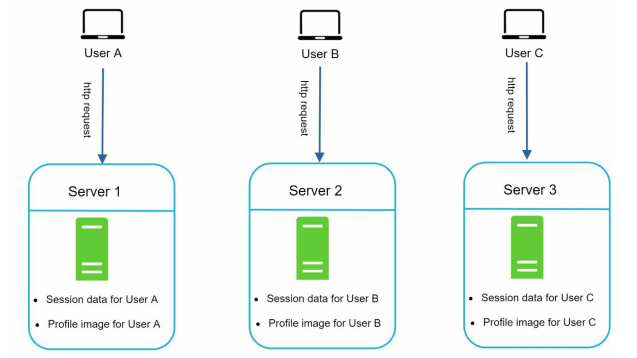
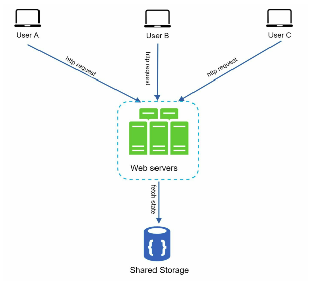
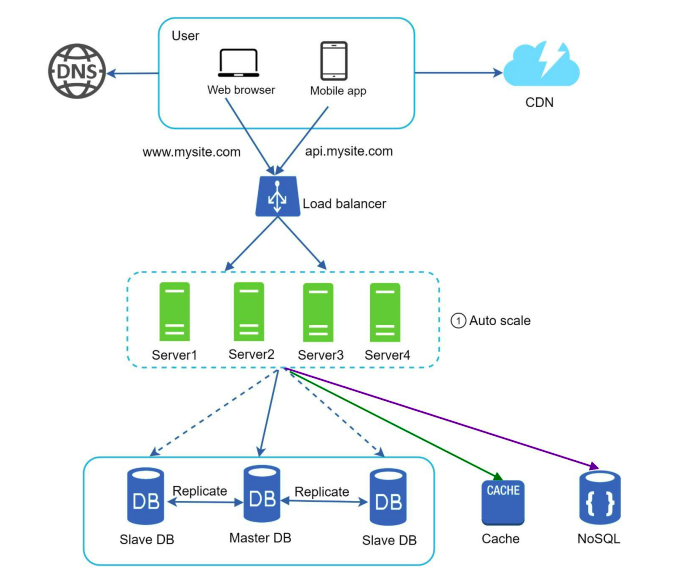

### Static Web Tier

**[English Below]**

### Tầng Web Tĩnh

Khi thiết kế hệ thống cần hỗ trợ khả năng mở rộng theo chiều ngang (**horizontal scaling**) cho tầng web, điều cần thiết là chuyển trạng thái (**state**) ra khỏi tầng web. Điều này bao gồm việc lưu trữ dữ liệu phiên (**session data**) trong một nơi lưu trữ dữ liệu liên tục (**persistent data store**) như cơ sở dữ liệu quan hệ (SQL) hoặc NoSQL. Việc di chuyển session data ra ngoài web tier giúp các web server trong cụm có thể truy cập dữ liệu trạng thái từ bộ lưu trữ dùng chung. Đây được gọi là **stateless web tier**.

#### Stateful Architecture

Trong kiến trúc **stateful**, máy chủ sẽ lưu trữ trạng thái của người dùng giữa các yêu cầu. Điều này bao gồm thông tin phiên làm việc, dữ liệu người dùng, hoặc các hoạt động trước đó. Ví dụ:

1. Khi một người dùng đăng nhập vào một trang web, trạng thái đăng nhập sẽ được lưu trữ và lần sau người dùng không cần đăng nhập lại.
2. Trạng thái giỏ hàng (cart) trong một trang thương mại điện tử được lưu trữ và duy trì khi người dùng chuyển qua các tab khác.
3. Trong game offline, trạng thái như điểm số, vị trí được lưu trữ trên server.

Hình minh họa kiến trúc stateful:

  

Trong trường hợp này:

- **User A** có session data được lưu trên **Server 1**. Tất cả các yêu cầu từ User A phải được gửi đến Server 1 để xác thực. Nếu yêu cầu được gửi đến **Server 2** hoặc **Server 3**, xác thực sẽ thất bại vì các server này không chứa session data của User A.
- Tương tự, các yêu cầu từ User B phải được gửi đến Server 2, và từ User C đến Server 3.

**Vấn đề với kiến trúc stateful**:

1. Mọi yêu cầu từ một client phải được gửi đến cùng một server duy nhất. Điều này thường được thực hiện thông qua cơ chế **sticky session** của load balancer, nhưng điều này làm tăng độ phức tạp và chi phí.
2. Thêm hoặc xóa server trở nên khó khăn hơn do trạng thái được lưu trên từng server.
3. Việc xử lý lỗi (server failure) cũng là một thách thức lớn.

#### Stateless Architecture

Hình minh họa kiến trúc stateless:

  

Trong kiến trúc **stateless**:

1. Các HTTP request từ người dùng có thể được gửi đến bất kỳ web server nào.
2. Các server này sẽ lấy dữ liệu trạng thái (state data) từ một nơi lưu trữ dữ liệu dùng chung (**shared data store**).
3. Dữ liệu trạng thái không được lưu trữ trên các web server, giúp hệ thống trở nên đơn giản hơn, mạnh mẽ hơn và có khả năng mở rộng cao hơn.

Hình minh họa thiết kế sau khi chuyển session data ra khỏi web tier:

  

Trong thiết kế này:

1. **Session data** được chuyển ra khỏi web tier và lưu trữ trong **persistent data store**. Persistent data store có thể là relational database, Memcached/Redis, hoặc NoSQL. **NoSQL** được ưa chuộng vì dễ mở rộng.
2. Việc thêm hoặc xóa server được thực hiện tự động dựa trên **traffic load**. Đây được gọi là **autoscaling**.

#### Lợi Ích Của Stateless Web Tier

1. **Dễ dàng mở rộng**: Sau khi loại bỏ state ra khỏi web server, việc thêm hoặc xóa server trở nên đơn giản hơn. Autoscaling đảm bảo rằng hệ thống có thể tự động điều chỉnh số lượng server theo lưu lượng truy cập.
2. **Tăng tính sẵn sàng**: Các HTTP request có thể được gửi đến bất kỳ server nào, giảm thiểu rủi ro khi một server bị lỗi.
3. **Hỗ trợ đa trung tâm dữ liệu (multi-data center)**: Với sự tăng trưởng nhanh chóng và sự mở rộng quốc tế, hỗ trợ nhiều trung tâm dữ liệu giúp cải thiện tính sẵn sàng và mang lại trải nghiệm người dùng tốt hơn trên toàn cầu.

---

### Static Web Tier

When designing a system that supports horizontal scaling for the web tier, it is necessary to move **state** (e.g., session data) out of the web tier. A good practice is to store session data in a **persistent data store** such as a relational database or NoSQL. This enables web servers in the cluster to access state data from the shared storage, known as the **stateless web tier**.

#### Stateful Architecture

In **stateful architecture**, servers retain the client’s state between requests. This state may include session information, user data, or previous actions. Examples include:

1. When a user logs into a website, the login state is retained, and the user doesn’t need to log in again.
2. Shopping cart state is retained in an e-commerce website even when the user navigates to other tabs.
3. Offline games retain user state, such as scores or positions, on the server.

Figure illustrates a stateful architecture:

  

In this scenario:

- **User A’s** session data is stored on **Server 1**, so all requests from User A must be routed to Server 1. If routed to **Server 2** or **Server 3**, authentication fails.
- Similarly, requests from User B must be routed to Server 2, and requests from User C to Server 3.

**Challenges with stateful architecture**:

1. All requests from the same client must be routed to the same server, often implemented through **sticky sessions** in load balancers, which adds complexity and cost.
2. Adding or removing servers becomes challenging as the state is stored on individual servers.
3. Handling server failures is difficult.

#### Stateless Architecture

Figure illustrates stateless architecture:

  

In **stateless architecture**:

1. HTTP requests can be routed to any web server.
2. Servers fetch state data from a **shared data store**.
3. State data is stored in the shared storage and not retained on web servers, making the system simpler, more robust, and scalable.

Figure illustrates the design after moving session data out of the web tier:

  

In this design:

1. **Session data** is moved out of the web tier and stored in **persistent data stores** like relational databases, Memcached/Redis, or NoSQL. **NoSQL** is preferred for its scalability.
2. Adding or removing servers is automated based on **traffic load**, enabling **autoscaling**.

#### Benefits of Stateless Web Tier

1. **Easier Scalability**: After removing state from web servers, adding or removing servers is simple. Autoscaling adjusts server count automatically based on traffic.
2. **Increased Availability**: HTTP requests can be routed to any server, minimizing the risk of server failure.
3. **Support for Multi-Data Centers**: As systems grow internationally, supporting multiple data centers enhances availability and user experience globally.
