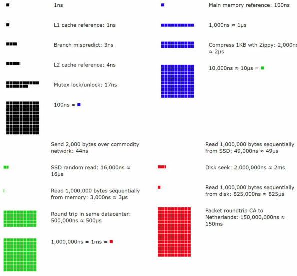

**[Vietnamese Below]**

## Latency Numbers

### Part 1: Introduction to Latency

**Latency** refers to the time required for an operation within a computer system to be executed. For modern systems, understanding the latency of each component is crucial for optimizing performance and designing efficient systems.

The table provided by Dr. Dean from Google showcases real-world latency measurements for various operations within a system. While some of these values may not be entirely accurate in today's context (due to technological advancements), they are still invaluable for understanding the relative speed of different operations.

### Part 2: Typical Latency Values

| **Operation Name**                            | **Time**                           |
|-----------------------------------------------|-------------------------------------|
| **L1 cache reference**                        | 0.5 ns                              |
| **Branch mispredict**                         | 5 ns                                |
| **L2 cache reference**                        | 7 ns                                |
| **Mutex lock/unlock**                         | 100 ns                              |
| **Main memory reference**                     | 100 ns                              |
| **Compress 1KB with Zippy**                   | 10,000 ns = 10 μs                   |
| **Send 2KB over a 1 Gbps network**            | 20,000 ns = 20 μs                   |
| **Read 1MB sequentially from memory**         | 250,000 ns = 250 μs                 |
| **Round trip within the same datacenter**     | 500,000 ns = 500 μs                 |
| **Disk seek**                                 | 10,000,000 ns = 10 ms               |
| **Read 1MB sequentially from the network**    | 10,000,000 ns = 10 ms               |
| **Read 1MB sequentially from disk**           | 30,000,000 ns = 30 ms               |
| **Send packet (California ↔ Netherlands)**    | 150,000,000 ns = 150 ms             |

### Part 3: Significance of the Values

#### **Memory is Fast, but Disk is Very Slow**
- **L1 Cache** is the fastest, taking only **0.5 ns** to access, whereas reading from disk (disk seek) takes up to **10 ms**.
- This highlights the significant difference in speed between memory (RAM, cache) and storage devices.

#### **Avoid Disk Access if Possible**
- Reading 1MB sequentially from memory takes only **250 μs**, but from disk, it takes **30 ms**.
- Disk seeks are extremely time-consuming and should be avoided by utilizing caching and optimized memory management.

#### **Compress Data Before Transmission**
- Compressing **1KB with Zippy** takes just **10 μs**, which is much faster than transmitting uncompressed data over the network.

#### **Data Transmission Between Data Centers**
- Sending data from **California to the Netherlands and back** takes **150 ms**, emphasizing the impact of geographical distance on transmission time.

#### **Effectiveness of Simple Compression**
- Compression algorithms like **Zippy** are simple, efficient, and quick, significantly reducing network resource usage.

### Part 4: Visualization Analysis

  

The visual representation of latency numbers highlights the differences in operation speeds. For instance:
- **L1 Cache** appears as a small square (the fastest).
- Slower operations like **reading from disk** or **sending data over the Internet** are represented by much larger blocks.

### Part 5: Conclusion

1. **Prioritize Fast Memory:** System designs should leverage RAM and cache to minimize latency.
2. **Minimize Disk Operations:** Avoid direct disk reads/writes unless absolutely necessary.
3. **Optimize Data Transmission:** Compress data before sending it over the network and distribute data closer to users to reduce latency.
4. **Understand Latency Values:** This knowledge allows developers to make informed decisions when optimizing system performance.

------

## Độ Trễ

### Phần 1: Giới thiệu về độ trễ

**Độ trễ (Latency)** là khoảng thời gian cần thiết để một thao tác trong hệ thống máy tính được thực hiện. Đối với các hệ thống hiện đại, hiểu rõ độ trễ của từng thành phần là yếu tố quan trọng để tối ưu hóa hiệu suất và thiết kế hệ thống hiệu quả.

Trong bảng được trình bày, Dr. Dean từ Google cung cấp các số liệu thực tế về độ trễ của nhiều thao tác trong hệ thống. Mặc dù một số giá trị có thể không hoàn toàn chính xác trong thời điểm hiện tại (do công nghệ đã phát triển), chúng vẫn rất hữu ích trong việc hiểu tương đối sự nhanh chậm giữa các thao tác.

### Phần 2: Các giá trị độ trễ điển hình

| **Tên thao tác (Operation Name)**             | **Thời gian (Time)**                |
|-----------------------------------------------|--------------------------------------|
| **Tham chiếu bộ nhớ cache L1**                | 0.5 ns                              |
| **Branch mispredict (Dự đoán nhánh sai)**     | 5 ns                                |
| **Tham chiếu bộ nhớ cache L2**                | 7 ns                                |
| **Khóa/mở khóa Mutex**                        | 100 ns                              |
| **Tham chiếu bộ nhớ chính (RAM)**             | 100 ns                              |
| **Nén 1KB dữ liệu với Zippy**                 | 10,000 ns = 10 μs                   |
| **Gửi 2KB qua mạng 1Gbps**                    | 20,000 ns = 20 μs                   |
| **Đọc 1MB tuần tự từ bộ nhớ**                 | 250,000 ns = 250 μs                 |
| **Một vòng trip trong trung tâm dữ liệu**     | 500,000 ns = 500 μs                 |
| **Tìm kiếm đĩa (Disk seek)**                  | 10,000,000 ns = 10 ms               |
| **Đọc 1MB từ mạng tuần tự**                   | 10,000,000 ns = 10 ms               |
| **Đọc 1MB tuần tự từ ổ đĩa**                  | 30,000,000 ns = 30 ms               |
| **Gửi gói từ California đến Hà Lan và ngược lại** | 150,000,000 ns = 150 ms             |

### Phần 3: Ý nghĩa của các giá trị

#### **Bộ nhớ nhanh nhưng ổ đĩa rất chậm**
- **L1 Cache** là nhanh nhất, chỉ tốn **0.5 ns** để truy cập, trong khi thao tác đọc từ ổ đĩa (disk seek) mất đến **10 ms**.
- Điều này cho thấy sự khác biệt rất lớn giữa bộ nhớ (RAM, cache) và các thiết bị lưu trữ.

#### **Tránh truy cập ổ đĩa nếu có thể**
- Đọc tuần tự 1MB từ bộ nhớ chỉ mất **250 μs**, nhưng từ ổ đĩa mất **30 ms**.
- Tìm kiếm dữ liệu trên đĩa (disk seek) rất tốn thời gian và nên tránh thông qua việc tối ưu hóa bộ nhớ đệm (cache).

#### **Nén dữ liệu trước khi truyền tải**
- Nén **1KB với Zippy** chỉ mất **10 μs**, nhanh hơn rất nhiều so với việc gửi dữ liệu thô qua mạng.

#### **Thời gian truyền tải dữ liệu giữa các trung tâm dữ liệu**
- Gửi dữ liệu từ **California đến Hà Lan và ngược lại** mất **150 ms**, cho thấy khoảng cách địa lý ảnh hưởng rất lớn đến thời gian truyền tải.

#### **Hiệu quả của các thao tác nén đơn giản**
- Thuật toán nén như **Zippy** tuy đơn giản nhưng rất hiệu quả và nhanh, giúp tiết kiệm tài nguyên mạng.

### Phần 4: Phân tích biểu đồ minh họa

  

Hình minh họa trực quan các con số độ trễ, cho thấy tỷ lệ khác biệt giữa tốc độ của các thao tác. Ví dụ:

- **L1 Cache** là một ô vuông nhỏ (nhanh nhất).
- Các thao tác chậm hơn như **đọc từ ổ đĩa** hay **gửi gói dữ liệu qua Internet** được minh họa bằng các khối lớn hơn nhiều.

### Phần 5: Kết luận

1. **Ưu tiên sử dụng bộ nhớ nhanh:** Thiết kế hệ thống nên tận dụng tối đa RAM và bộ nhớ cache để giảm độ trễ.
2. **Giảm thao tác với ổ đĩa:** Tránh đọc/ghi trực tiếp từ ổ đĩa nếu không cần thiết.
3. **Tối ưu hóa truyền tải dữ liệu:** Nén dữ liệu trước khi gửi qua mạng và phân phối dữ liệu gần người dùng để giảm thiểu thời gian chờ.
4. **Hiểu rõ các giá trị độ trễ:** Điều này giúp lập trình viên đưa ra các quyết định chính xác trong việc tối ưu hóa hiệu suất của hệ thống.
