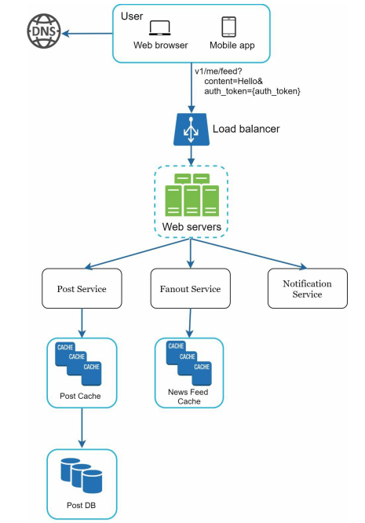
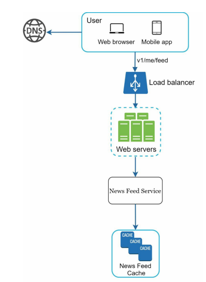

**[Vietnamese Below]**

## Step 2 - Propose High-Level Design and Get Buy-In

In this step, the goal is to develop a high-level design and reach agreement with stakeholders on this design. Collaboration during the design process is a great way to improve quality and effectiveness.

- **Draft an initial blueprint:** Create a preliminary design and gather feedback. Treat stakeholders as teammates and work together. Many great collaborators are eager to share ideas and get involved.
- **Draw system diagrams:** Create box diagrams with key components on a whiteboard or paper. These components might include clients (mobile/web), APIs, web servers, data stores, cache, CDN, message queue, etc.
- **Perform basic calculations:** Evaluate whether your initial blueprint can handle scale constraints. Think carefully and, if necessary, perform back-of-the-envelope calculations to validate feasibility before diving into details.
- **Leverage concrete use cases:** If possible, use specific use cases. This helps frame the high-level design and can reveal edge cases you might have missed.

Example:

- **Should API endpoints and database schemas be included?** This depends on the specific problem. For large problems like "Design Google Search," such low-level details are unnecessary. However, for smaller problems like designing the backend for a multiplayer poker game, these details are relevant.

### **Example Illustration**

Let’s use "Design a news feed system" to demonstrate how to approach the high-level design. At this stage, you don’t need to understand how the entire system works because details will be explained in Chapter 11.

At a high level, the design is divided into two main flows:

1. **Feed Publishing:** When a user publishes a post, corresponding data is written into cache or database, and the post is distributed to friends' news feeds.
2. **Newsfeed Building:** The news feed is built by aggregating friends' posts in reverse chronological order.

High-level designs for feed publishing and news feed building are presented in the following figure:

  

  

---

## Bước 2 - Đề Xuất Thiết Kế Cấp Cao và Đạt Đồng Thuận

Trong bước này, mục tiêu là phát triển một thiết kế cấp cao và đạt được sự đồng thuận với các bên liên quan về thiết kế này. Việc cộng tác trong quá trình thiết kế là một cách tuyệt vời để cải thiện chất lượng và hiệu quả.

- **Lên kế hoạch bản thiết kế ban đầu:** Xây dựng bản thiết kế sơ bộ và thu thập phản hồi. Đối xử với các bên liên quan như đồng đội và cùng làm việc. Nhiều cộng sự giỏi thường thích chia sẻ ý tưởng và tham gia vào quá trình này.
- **Vẽ sơ đồ hệ thống:** Tạo các sơ đồ hộp với các thành phần chính trên bảng trắng hoặc giấy. Những thành phần này có thể bao gồm ứng dụng khách (mobile/web), API, máy chủ web, kho dữ liệu, bộ nhớ đệm (cache), mạng phân phối nội dung (CDN), hàng đợi tin nhắn (message queue), v.v.
- **Thực hiện tính toán cơ bản:** Đánh giá xem thiết kế sơ bộ của bạn có phù hợp với các giới hạn quy mô không. Cân nhắc kỹ lưỡng và, nếu cần thiết, thực hiện các tính toán cơ bản để đảm bảo tính khả thi trước khi đi vào chi tiết.
- **Sử dụng các trường hợp thực tế:** Nếu có thể, hãy sử dụng các trường hợp sử dụng cụ thể. Điều này giúp định hình thiết kế cấp cao và có thể khám phá ra các trường hợp ngoại lệ (edge cases) mà bạn chưa nghĩ đến.

Ví dụ:

- **Nên bao gồm các endpoint API và sơ đồ cơ sở dữ liệu không?** Điều này tùy thuộc vào vấn đề cụ thể. Với các bài toán lớn như "Thiết kế hệ thống tìm kiếm của Google," các chi tiết ở mức thấp như vậy là không cần thiết. Tuy nhiên, với các bài toán nhỏ hơn, như thiết kế backend cho một trò chơi poker nhiều người chơi, các chi tiết này là phù hợp.

### **Ví Dụ Minh Họa**

Hãy sử dụng bài toán "Thiết kế một hệ thống dòng tin (news feed)" để minh họa cách tiếp cận thiết kế cấp cao. Tại bước này, bạn không cần hiểu toàn bộ cách hệ thống hoạt động vì các chi tiết sẽ được giải thích ở Chương 11.

Ở cấp cao, thiết kế được chia thành hai luồng chính:

1. **Xuất Bản Dòng Tin (Feed Publishing):** Khi người dùng đăng một bài viết, dữ liệu tương ứng sẽ được ghi vào bộ nhớ đệm hoặc cơ sở dữ liệu. Sau đó bài viết được phân phối tới dòng tin của bạn bè.
2. **Xây Dựng Dòng Tin (Newsfeed Building):** Dòng tin được xây dựng bằng cách tổng hợp các bài đăng của bạn bè theo thứ tự thời gian ngược.

Thiết kế cấp cao cho xuất bản dòng tin và xây dựng dòng tin được trình bày như sau:

  

  

