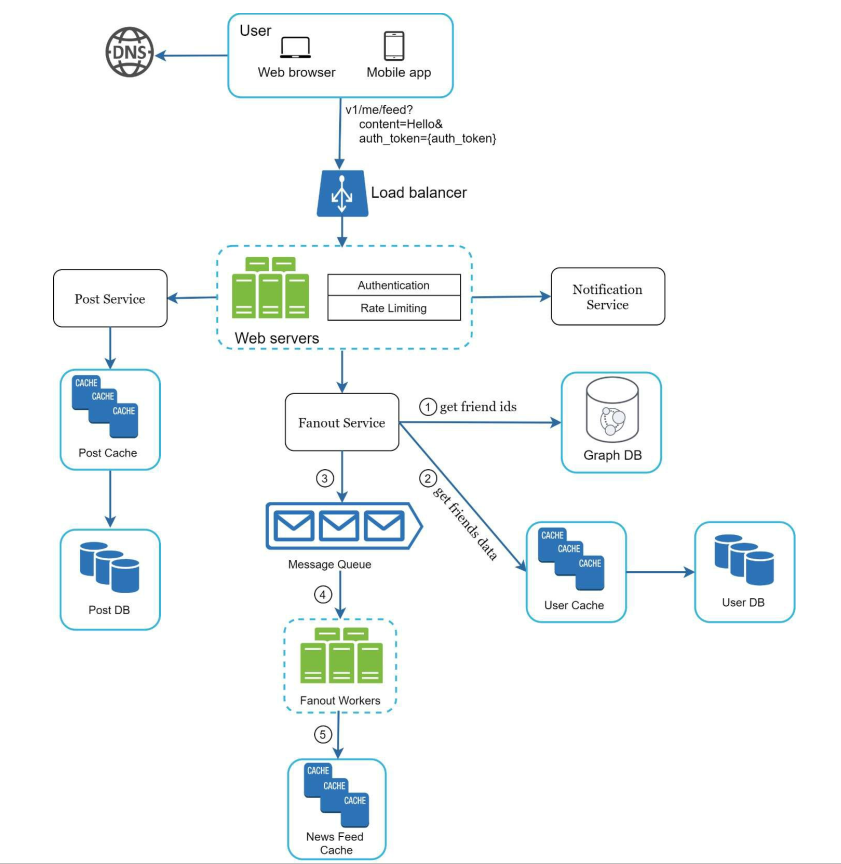
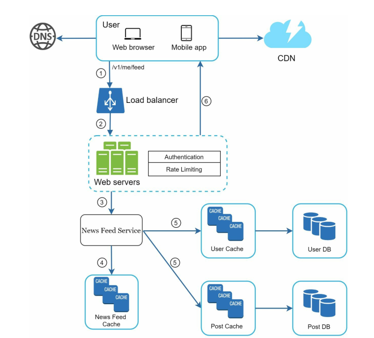

**[Vietnamese Below]**

## Step 3 - Design Deep Dive

- At this step, you and the stakeholders need to achieve the following objectives:

  - Align on the overall goals and functional scope.
  - Sketch out a high-level design for the entire system.
  - Gather feedback from stakeholders on the high-level design.
  - Develop initial ideas about specific areas to dive deeper into based on the feedback.

- **Identify and Prioritize Architectural Components**

  - Work with stakeholders to identify and prioritize the key components in the architecture.

  - It is important to emphasize that each project is different. Sometimes, the focus may be on the high-level design, while at other times, the attention might shift to system performance characteristics, bottlenecks, or resource estimations.

- **Examples of Design Deep Dive**

1. URL Shortener

   - Study how to design a hash function that converts a long URL into a short URL.
   - Focus on reducing latency and supporting online/offline statuses.

2. Chat System

   - Explore how to support online/offline statuses.
   - Determine how to synchronize messages across devices and handle network synchronization.

- **Example: Design Deep Dive for News Feed System**

At this stage, we have already discussed the high-level design for a news feed system, and all stakeholders are satisfied with your proposal. Next, we will dive deeper into two of the most important use cases:

1. Feed Publishing.

  

2. News Feed Retrieval.

  

---

## Bước 3 - Đi sâu vào thiết kế

- Tại bước này, bạn và các bên liên quan (stakeholder) cần đạt được các mục tiêu sau:

  - Thống nhất về các mục tiêu tổng thể và phạm vi chức năng
  - Phác thảo một bản thiết kế cấp cao cho toàn bộ hệ thống
  - Thu thập phản hồi từ các bên liên quan (stakeholder) về thiết kế cấp cao
  - Có một số ý tưởng ban đầu về các lĩnh vực cần đi sâu dựa trên phản hồi

- **Xác định và ưu tiên các thành phần kiến trúc**

  - Làm việc với các bên liên quan để xác định và sắp xếp thứ tự ưu tiên các thành phần trong kiến trúc

  - Điều quan trọng là nhấn mạnh rằng mỗi dự án sẽ khác nhau. Đôi khi, trọng tâm là thiết kế cấp cao, nhưng lại có những lúc cần phải tập trung vào các đặc điểm hiệu suất hệ thống, điểm nghẽn (bottlenecks) hoặc ước tính tài nguyên

- **Ví dụ về đi sâu vào thiết kế**

1. Rút ngắn URL (URL Shortener)

   - Nghiên cứu cách thiết kế hàm băm (hash function) để chuyển đổi một URL dài thành một URL ngắn
   - Tập trung vào cách giảm độ trễ và hỗ trợ trạng thái trực tuyến/ngoại tuyến

2. Hệ thống trò chuyện (Chat System)
   - Tìm hiểu cách hỗ trợ các trạng thái trực tuyến/ngoại tuyến
   - Xác định cách đồng bộ tin nhắn giữa các thiết bị và đồng bộ các mạng

- **Ví dụ: Đi sâu vào hệ thống news feed**

Tại bước này, chúng ta đã thảo luận về thiết kế cấp cao cho một hệ thống news feed, và tất cả các bên liên quan hài lòng với đề xuất của bạn. Tiếp theo, chúng ta sẽ đi sâu vào hai trường hợp sử dụng quan trọng nhất:

1. Xuất bản dòng tin (Feed Publishing).

  

2. Truy xuất dòng tin (News Feed Retrieval).

  

